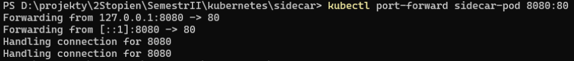
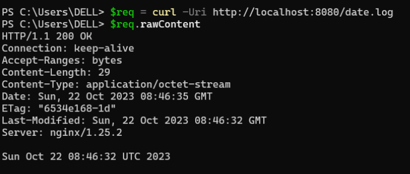

# sidecar

# Uruchomienie poda  
`kubectl apply -f sidecar-pod.yaml`  

# Przekierowanie portu nginx  
`kubectl port-forward sidecar-pod 8080:80`  


# Sprawdzenie zawartości udostępnianej przez nginx
```
$req = curl -Uri http://localhost:8080/date.log
$req.rawContent


```
